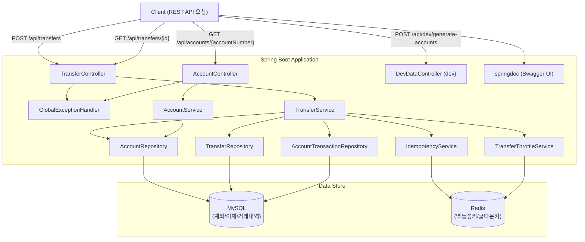
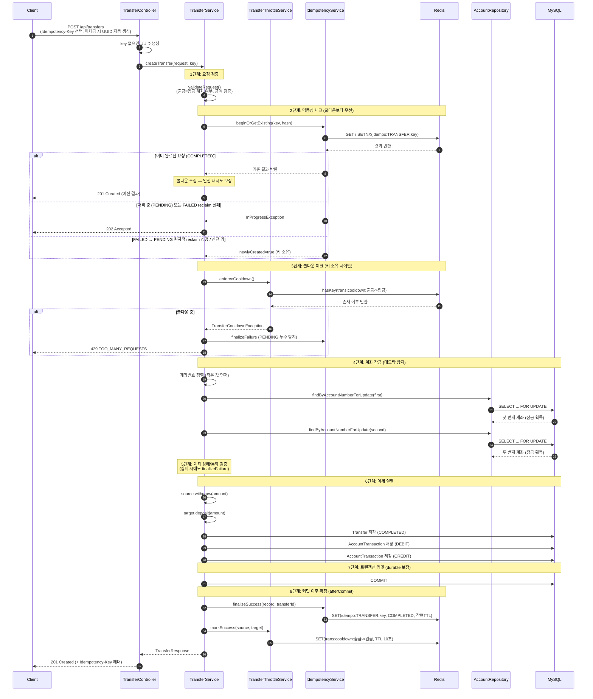
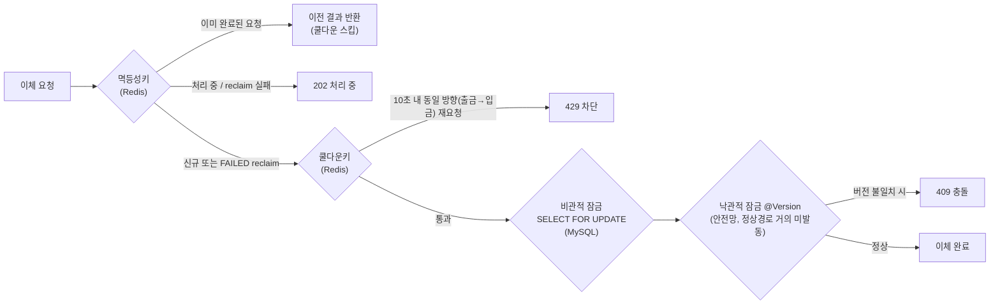

# Bank Transfer System Backend (RESTful)
**긍정적으로 일하고 세상에 도움이 되는 사람이 되자.**
<br>
<br>
안녕하세요 먼저 귀한 시간을 내어 저의 깃허브에 방문해 주신 것에 감사드립니다.<br/>
저는 팀의 일원으로서 팀원들과 함께 좋은 에너지를 만들며 일하고 싶고, 동시에 혼자 고민하는 시간을 통해 전문가로서의 역량을 기르고자 하고 적은 비용으로 어떻게 하면 많은 효과를 누릴 수 있을까? 하고 생각하는 개발자입니다.
<br>
<br>
이 프로젝트는 은행 이체 REST API를 통해 **MySQL 동시성 정합성**과 **Redis 멱등성/스로틀**을 중심으로 구현했으며, 대량 데이터 **인덱스 조회**도 함께 실험했습니다.


## 기술 스택

| 구분 | 기술 |
|------|------|
| Language | Java 17 |
| Framework | Spring Boot 3.3.4 |
| ORM | Spring Data JPA (Hibernate) |
| Database | MySQL 8 |
| Cache | Redis (멱등성키 / 쿨다운키) |
| API Docs | springdoc-openapi 2.6.0 (Swagger UI) |
| Test | JUnit 5 (로컬 MySQL / Redis 통합 테스트) |

## 이 프로젝트에서 증명하는 것

- `SELECT ... FOR UPDATE` + **계좌번호 정렬 잠금**으로 교차 이체 데드락 방지
- Redis **Idempotency-Key** / **쿨다운 키**로 중복·연속 이체 요청 차단
- MySQL **Serializable 세션 실험**에서 락 대기 타임아웃을 확인한 뒤, **REPEATABLE READ + 비관적 잠금**으로 전환한 근거 문서화
- `@Version` 낙관적 잠금을 비관적 잠금의 **추가 안전망**으로 배치 (정상 이체 경로에서는 거의 발동하지 않음)
- 이체 성공 확정(Redis `COMPLETED`/쿨다운)을 **트랜잭션 커밋 이후(afterCommit)** 로 반영해 "DB 미커밋 + Redis 완료" 상태 불일치 방지
- 약 200만 건 고객 데이터로 **복합 인덱스** 조회 실험

## 프로젝트 구조

```
BankTransferSys_Backend_Restful/
├── .env.example          # 환경 변수 템플릿 (실제 시크릿은 .env, 커밋 제외)
├── build.gradle
├── settings.gradle
├── gradlew / gradlew.bat
├── gradle/wrapper/
└── src/main/
    ├── java/com/banktransfer/
    │   ├── config/           # IdempotencyProperties, RedisConfig, TransferThrottleProperties
    │   ├── controller/       # Transfer, Account, DevData(dev 전용)
    │   ├── dto/
    │   ├── exception/        # GlobalExceptionHandler + 도메인 예외
    │   ├── model/            # JPA 엔티티(Account, Customer, Transfer, AccountTransaction 등)
    │   │                      #  + IdempotencyRecord(Redis 저장용 POJO, 엔티티 아님)
    │   ├── repository/
    │   ├── service/          # Transfer, Idempotency, TransferThrottle, Account
    │   └── util/
    └── resources/
        ├── application.properties
        └── application-dev.properties

src/test/
├── java/com/banktransfer/
│   ├── TransferConcurrencyIT.java      # 동시성 정합성 통합 테스트
│   ├── TransferIdempotencyIT.java      # 멱등성/쿨다운 통합 테스트
│   └── support/AbstractContainerIT.java # 로컬 MySQL/Redis 통합 테스트 기반 클래스
└── resources/
    └── application-test.properties
```

## 실행 방법

### 사전 요구사항

- JDK 17+
- MySQL 8  
  - 앱 실행: `bank_TransferSys`  
  - 통합 테스트: `bank_transfer_test` (없으면 JDBC가 생성, 테스트 종료 시 `create-drop`으로 스키마 정리)
- Redis (기본 포트: `6379`)  
  - 앱: DB index `0`  
  - 통합 테스트: DB index `1` (앱 데이터와 분리)

### 설정

DB 계정/비밀번호는 저장소에 넣지 않습니다. `.env.example`을 참고해 로컬에서 환경 변수를 설정하세요. (셸 export 또는 IDE Run Configuration에 주입해주세요.)

| 환경 변수 | 기본값 / 필수 | 설명 |
|-----------|---------------|------|
| `DB_HOST` / `DB_PORT` / `DB_NAME` | `127.0.0.1` / `3306` / `bank_TransferSys` | MySQL 접속 정보 |
| `DB_USERNAME` / `DB_PASSWORD` | **필수** (기본값 없음) | MySQL 계정 |
| `REDIS_HOST` / `REDIS_PORT` / `REDIS_DATABASE` | `127.0.0.1` / `6379` / `0` | Redis 접속 정보 |

```bash
# 1) 예시 파일 확인
cp .env.example .env   # 값을 채운 뒤 .env는 커밋하지 마세요

# 2) 셸에 환경 변수 주입 후 실행 (macOS / Linux 예시)
export DB_USERNAME='your_mysql_user'
export DB_PASSWORD='your_mysql_password'
./gradlew bootRun
```

```powershell
# Windows PowerShell 예시
$env:DB_USERNAME='your_mysql_user'
$env:DB_PASSWORD='your_mysql_password'
.\gradlew.bat bootRun
```

### 애플리케이션 실행

```bash
# Windows
gradlew.bat bootRun

# macOS / Linux
./gradlew bootRun
```

- 기본 포트: `8080`
- Swagger UI: [http://localhost:8080/swagger-ui.html](http://localhost:8080/swagger-ui.html)
- OpenAPI JSON: [http://localhost:8080/api-docs](http://localhost:8080/api-docs)

## API 목록

| Method | Path | 설명 |
|--------|------|------|
| POST | `/api/transfers` | 이체 생성 (`Idempotency-Key` 선택, 미제공 시 서버 UUID 자동 생성) |
| GET | `/api/transfers/{id}` | 이체 조회 |
| GET | `/api/accounts/{accountNumber}` | 계좌번호로 계좌 조회 |
| POST | `/api/dev/generate-accounts` | dev profile 전용 — 더미 고객·계좌 약 200만 건 생성 |

## 테스트

로컬에서 실행 중인 MySQL·Redis에 연결해 동시성·멱등성 통합 테스트를 검증합니다. (Docker / Testcontainers 불필요)

| 구분 | 앱 (`bootRun`) | 테스트 (`test`) |
|------|-----------------|-----------------|
| MySQL DB | `bank_TransferSys` | `bank_transfer_test` |
| Redis DB index | `0` | `1` |
| 스키마 | `ddl-auto=update` (dev) | `ddl-auto=create-drop` |

`DB_USERNAME` / `DB_PASSWORD`는 앱 실행과 동일하게 환경 변수로 주입합니다.

```powershell
# Windows (PowerShell)
$env:DB_USERNAME='your_mysql_user'
$env:DB_PASSWORD='your_mysql_password'
.\gradlew.bat test
```

```bash
# macOS / Linux
export DB_USERNAME='your_mysql_user'
export DB_PASSWORD='your_mysql_password'
./gradlew test
```

| 테스트 클래스 | 검증 내용 |
|--------------|----------|
| `TransferConcurrencyIT` | 동일 출금 계좌 동시 이체 잔액 정합성, 교차 이체(A↔B) 데드락 부재 |
| `TransferIdempotencyIT` | 동일 키 재요청/동시 요청 단일 이체, COMPLETED 쿨다운 스킵, 새 키 429, payload 충돌 409 |

## 아키텍처 다이어그램

### 1. 시스템 구성도



### 2. 이체 처리 흐름 (Sequence Diagram)



### 3. 다층 보호 구조



> **역할 구분:** 멱등성키를 **먼저** 검사해 완료된 동일 요청의 재시도가 쿨다운(429)에 가려지지 않게 합니다. 쿨다운은 키를 새로 소유한 요청에만 적용되어 동일 방향 연타를 완화합니다. `FOR UPDATE`는 잔액 정합성, `@Version`은 비관적 잠금이 누락된 경로를 대비한 보조 계층입니다.

---

## 동시성·트랜잭션 설계

### 배경 실험 (앱 코드가 아닌 MySQL 세션 실험)

정합성이 중요한 이체 도메인에서 **격리 수준만으로** 문제를 풀 수 있는지 확인하기 위해, 애플리케이션이 아닌 **MySQL 클라이언트 두 세션**으로 Serializable을 실험했습니다.

- **가설:** Serializable이면 정합성이 가장 높아 이체 시스템에 적합할 것이다.
- **시나리오:** 세션1이 레코드 A를 갱신한 뒤 커밋하지 않은 상태에서, 세션2가 동일 레코드 A에 차감을 시도.
- **결과:** 후속 요청이 선행 트랜잭션 종료까지 대기하다 **락 대기 타임아웃**으로 실패.

**같은 레코드에 대하여 요청한 쿼리:**


**타임아웃이 발생하여 연결이 끊어짐:**


**문제점 분석:**  
동일 레코드에 대한 동시 쓰기 경쟁이 커지면 대기·타임아웃이 늘어 처리량이 급격히 떨어질 수 있습니다. Serializable은 정합성은 높지만, 동시 읽기·대량 처리 관점의 비용이 큽니다. “격리 수준만 올리면 된다”는 접근은 이체 도메인에 그대로 쓰기 어렵다고 판단했습니다.

**애플리케이션에 적용한 해결:**  
MySQL InnoDB 기본 격리 수준인 **REPEATABLE READ**를 유지하고, 이체 시점에만 `SELECT ... FOR UPDATE`로 필요한 계좌를 잠급니다. 여기에 Redis 멱등성키·쿨다운키, `@Version`을 더해 다층으로 보호합니다.

> **P.S) 격리 수준 설정:** 본 프로젝트 코드에는 `@Transactional(isolation = ...)` 또는 `hibernate.connection.isolation`을 두지 않았습니다. 정합성은 **비관적 잠금 + 낙관적 잠금(안전망)** 으로 보장합니다.

### @Version / 멱등성키 / 쿨다운키

**@Version (낙관적 잠금)**  
엔티티 수정 시 version이 증가하고, UPDATE 시점에 불일치하면 트랜잭션이 실패합니다(`409`). 이체 경로는 이미 `FOR UPDATE`로 직렬화되므로 정상 흐름에서는 거의 발동하지 않습니다. 비관적 잠금이 누락된 코드 경로를 대비한 **저비용 안전망**으로 두었습니다.

**멱등성키 (Idempotency-Key)**  
이체 요청 헤더의 고유 키로 동일 요청의 재시도를 안전하게 처리합니다. 헤더 생략 시 서버가 UUID를 생성하고 응답 헤더에 반환합니다.

| 상태 | 응답 |
|------|------|
| 처리 중 (PENDING) 동일 키 재요청 | `202 Accepted` — “요청이 처리 중입니다.” |
| 완료 (COMPLETED) 동일 키 재요청 | `201 Created` — 이전 이체 결과 반환 (**쿨다운 검사 전**에 처리) |
| 실패 (FAILED) 동일 키 재요청 | reclaim 락으로 `FAILED→PENDING` 원자 전환 후 재시도. 동시 재획득 실패 시 `202` |
| 동일 키 + 다른 payload | `409 Conflict` |

- Redis 키: `idempo:TRANSFER:{Idempotency-Key}`
- TTL: **24시간(86400s)** — 트랜잭션/락 대기보다 길게 설정해 PENDING 만료로 인한 이중 이체·COMPLETED 미기록을 방지
- 검증·이체 실패 시 `finalizeFailure`로 `FAILED`를 기록해 **PENDING 누수**를 막습니다.

**P.S) 커밋-Redis 정합성 (afterCommit 확정)**  
성공 확정(`COMPLETED` 기록 + 쿨다운 설정)은 이체 로직 도중이 아니라 `TransactionSynchronization.afterCommit()`에서 실행합니다. DB가 **durable하게 커밋된 뒤에만** Redis에 반영하므로, 이체 저장 후 커밋이 실패해도 Redis에는 `COMPLETED`가 남지 않습니다.

| 시점 | 처리 |
|------|------|
| 이체 로직 중 예외 | `finalizeFailure`(`FAILED`) 후 롤백 — PENDING 누수 방지 |
| 커밋 성공 | `afterCommit`에서 `finalizeSuccess`(`COMPLETED`) + 쿨다운 설정 |
| 저장 성공 후 **커밋 실패** | `afterCommit` 미실행 → Redis는 `PENDING` 유지 → TTL이 24h로 길어져 만료 회수는 느림. **실패 기록(`FAILED`)된 키의 실질 재시도·회수는 `reclaim`(FAILED→PENDING)** |

이체가 실제로 커밋되지 않았는데 멱등성 캐시가 `COMPLETED`로 남아, 이후 재조회(`findById`)가 실패하는 상태 불일치를 방지하기 위한 설계입니다. (트랜잭션 동기화가 비활성인 예외적 상황에서는 즉시 반영으로 폴백합니다.)

**P.S) 진행 중 요청: Polling vs Fast-Fail**  
PENDING 중복 요청에 대해 서버에서 폴링 대기 후 결과를 주는 방식도 검토했으나, 스레드 점유와 실패 시 대기 연장 리스크 때문에 **즉시 202 반환(Fast-Fail)** 을 선택했습니다.

**쿨다운키 (Cooldown Key)**  
**동일한 출금 → 입금 방향** 이체가 성공한 뒤 10초 안에 **새 멱등성 키**로 다시 들어오면 `429 Too Many Requests`로 차단합니다. (역방향 B→A는 별도 키.)  
멱등성키(안전 재시도)와 달리 **연타·남용성 연속 요청**을 줄이는 목적이며, **COMPLETED 재조회 경로에는 적용하지 않습니다.**

- Redis 키: `trans:cooldown:{출금계좌}->{입금계좌}`
- TTL: **10초** (데모용)

### 데드락(Deadlock) 방지 전략

| 시간 순서 | 트랜잭션 A (계좌1 → 계좌2) | 트랜잭션 B (계좌2 → 계좌1) |
|-------|---------------------------|---------------------------|
| 1 | 계좌1 잠금 | 계좌2 잠금 |
| 2 | 계좌2 대기 | 계좌1 대기 |
| 결과 | **데드락** — 서로 상대 잠금 해제 대기 | |

**해결:** 출금/입금 계좌번호를 문자열 기준으로 정렬해 **항상 작은 값부터** 잠급니다.

```java
String first  = sourceAccountNumber.compareTo(targetAccountNumber) <= 0
        ? sourceAccountNumber : targetAccountNumber;
String second = sourceAccountNumber.compareTo(targetAccountNumber) <= 0
        ? targetAccountNumber : sourceAccountNumber;
Account firstAcc  = accountRepository.findByAccountNumberForUpdate(first);
Account secondAcc = accountRepository.findByAccountNumberForUpdate(second);
```

**적용 후:**

| 시간 순서 | 트랜잭션 A (계좌1 → 계좌2) | 트랜잭션 B (계좌2 → 계좌1) |
|-------|---------------------------|---------------------------|
| 1 | 계좌1 잠금 (1 &lt; 2이므로 먼저) | 계좌1 대기 |
| 2 | 계좌2 잠금 | 대기 중 |
| 3 | 이체 완료, 잠금 해제 | 계좌1 잠금 |
| 4 | | 계좌2 잠금 → 이체 완료 |

잠금 획득 순서가 항상 같아 교차 이체에서도 데드락이 발생하지 않습니다.

---

## 인덱스 실험

이체 정합성과는 별도로, MySQL **복합 인덱스·카디널리티·좌측 접두사**를 확인하기 위한 보조 실험입니다.

- **인덱스:** `idx_customer_name_combined (name, bank, gender)` — 카디널리티가 높은 `name`을 앞에 배치
- **조회 조건:** `name LIKE 'ql%'` + `bank = 'WOORI'` + `gender = 'MALE'` (B-Tree 좌측 접두사에 맞춘 조건)

### 재현 방법

1. 애플리케이션을 dev profile로 실행합니다.
2. `POST /api/dev/generate-accounts`로 `customers`에 약 200만 건을 생성합니다.
3. 복합 인덱스가 DDL에 반영되었는지 확인합니다.
4. 아래 쿼리로 `EXPLAIN`과 실행 시간을 비교합니다. (가능하면 **버퍼 풀 cold/warm**, **동일 쿼리 반복**을 구분해 측정하세요.)

```sql
EXPLAIN
SELECT * FROM customers
WHERE name LIKE 'ql%'
  AND bank = 'WOORI'
  AND gender = 'MALE';
```

### 프로젝트에 정의된 주요 인덱스

| 테이블 | 인덱스명 | 컬럼 | 용도 |
|--------|---------|------|------|
| `customers` | `idx_customer_name_combined` | name, bank, gender | 인덱스 성능 실험 |
| `accounts` | `idx_account_balance` | balance | 잔액 조건 조회 |
| `accounts` | `uq_account_number` | account_number (UNIQUE) | 계좌번호 유일성 |
| `transfers` | `idx_transfer_created_at` | created_at | 최신 이체 내역 조회 |
| `account_transactions` | `idx_account_tx_account` | account_id | 계좌별 거래내역 조회 |
| `account_transactions` | `idx_account_tx_transfer` | transfer_id | 이체별 거래내역 조회 |

### 측정 결과 (참고)

로컬 MySQL에서 동일 조건 조회 시, 인덱스 미적용 약 **0.031s**, 적용 후 약 **0.016s**로 측정되었습니다(약 48% 단축).

**인덱스 사용 전:**


**인덱스 사용 후:**


**P.S) PK:** InnoDB는 PK가 없으면 내부 일련번호 컬럼을 만드는데, 애플리케이션에서 접근할 수 없습니다. 접근 가능한 PK를 명시하는 편이 유리합니다.

---

## 다른 포트폴리오

- [Cursor Agent로 GitHub Copilot을 저렴하게 사용해보기](https://github.com/Pray-T/GitHub-Copilot-With-Cursor.git)
- [AWS에 배포·운영한 JWT+Redis 이중 토큰 인증과 실시간 채팅 웹 앱](https://github.com/Pray-T/ReadyPlz-Production_main.git)

**이상입니다, 저의 깃허브 방문을 감사드립니다.**
