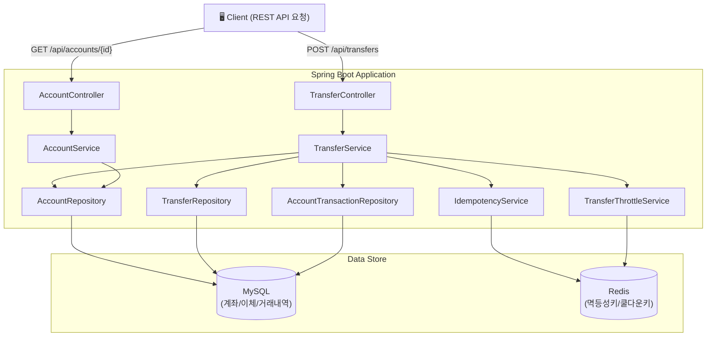
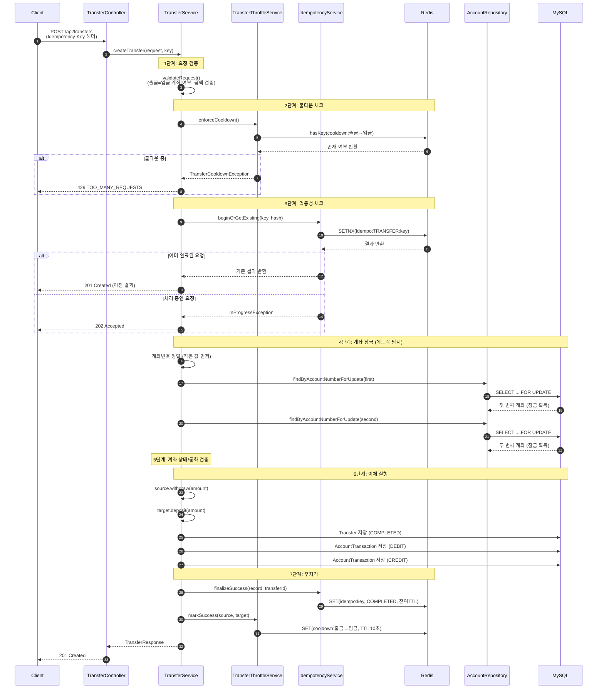
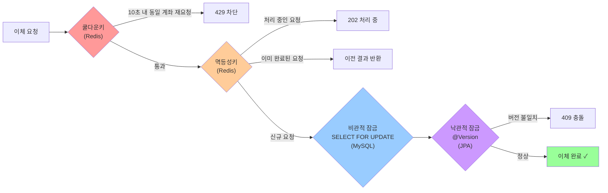

| 인사말 |

안녕하세요, 먼저 귀한시간을 내어 저의 깃허브에 방문해주신것에 대한 감사를 먼저 드립니다.
 저는 팀의 일원으로서 팀원들과 함께 좋은 에너지와 좋은 시너지를 만들며 일을 하고 싶고 동시에 개인적으로 혼자 고민하는 시간을 갖고 그것을 토대로 성장하는 전문가로서의 역량을 기르고자 하는 개발자입니다.

 해당 포트폴리오는 RESTful API형태로 은행의 이체시스템의 백엔드를 구현한 포트폴리오이며 MySQL의 트랜잭션(동시성 제어)과 인덱스(인덱스를 통한 성능개선)에 관련된 포트폴리오입니다. 

## 아키텍처 다이어그램
### 1. 시스템 구성도

### 2. 이체 처리 흐름 (Sequence Diagram)

### 3. 다층 보호 구조

## MYSQL의 트랜잭션(정합성이 중요한 이체시스템에서 격리화 단계는 어떻게 설정해야할까? 또한 한 레코드에 동시에 접근한다면 어떻게 될까?)

- 케이스: 정합성이 중요한 이체 시스템에서 정합성을 최고 우선시하여 격리화 최고 단계인 Serializable을 사용한 케이스.

- 예상 결과: 응답시간은 조금 더 걸리고 가용성은 줄어들겠지만 정합성이 뛰어나 이체시스템에 적합한 격리단계라고 판단됩니다.

- 실험 시나리오: 격리화 단계 Serializable에서 같은 레코드에 접근하였습니다. 세션1에서 레코드A에 접근하여 차감 요청을 한뒤 커밋하지 않고 세션2에서 또 다시 레코드A에 차감요청을 하였습니다.

- 시나리오에서 발생한 문제점:  한 레코드에 대해서 동시에 요청을 한 경우 나중에 요청된 것들은 그 앞의 트랜잭션이 끝나기까지 대기하다가 대기시간 타임 아웃으로 요청이 실행되지 않음.
 
 

  **같은 레코드에 대하여 요청한 쿼리:**  
  
 

  **타임아웃이 발생하여 연결이 끊어짐:**  

 

 **문제점 분석:**  
 같은 레코드에 위와 같은 요청이 동시에 들어온다면 추후에 들어온 요청은 먼저번의 요청이 끝날 때까지 대기하다가 타임 아웃을 발생시킬 확률이 존재합니다. 실무에서 사용된다면 실제 서비스가 불가능합니다.  
 게다가 Serializable은 모든 조회 쿼리가 공유 잠금이 걸려있어 동시 읽기 성능이 크게 저하됩니다. 이는 대기시간 증가와 대용량 처리에 있어서 문제가 발생할 가능성이 큽니다. 
 결론적으로 정합성을 최우선의 가치를 두어서 사용한 Serializable은 실무에서 사용하기엔 많은 문제점을 발생시킵니다. 동시성 문제를 해결하기 위해서 많은 것들을 포기해야 합니다.

**해결 방안:**  
격리화 수준을 한 단계 낮춰서 Repeteable Read로 변경하고 레코드의 변경이 필요한 쿼리 요청(이체 요청)은 "Select ... for Update" 을 통하여 읽기 성능 저하를 최소화 합니다. 
또한 레코드의 변경이 필요한 요청만 해당 레코드를 잠금하여 동시가 같은 레코드에 접근하는 요청에 대하여 트랜잭션을 직렬화 하여 정합성을 보장합니다. (일반적으로 Repeteable Read는 쓰기 잠금중인 레코드 또한 읽을 수 있지만 이는 스냅샷에 저장된 변경되기 이전의 값입니다. 하지만 "Select ... for Update"로 조회를 한다면 Repeteable Read에서도 쓰기가 완료되기까지 대기하였다가 완료된 이후에 값을 보여줍니다. 그리하여 한 레코드에 대해서 동시에 접근해도 안전한 이체기능을 수행할 수 있습니다.)
  또한 @Version과 멱등성키(Idempotency-key), 쿨다운키의 사용으로 다층적인 보호작업이 추가적으로 들어감으로써 안정성을 더 확보했습니다.

**사용된 @Version, 멱등성키, 쿨다운키(Cooldown Key)에 관하여:**  
**@Version** 은 낙관적 잠금(Optimistic Lock)을 위해 사용되었습니다. 엔티티가 수정되면 version 값이 자동으로 증가하며, UPDATE 시점에 읽어온 version과 현재 DB의 version이 다르면 트랜잭션을 실패시킵니다. 
해당 프로젝트에서는 비관적 잠금(SELECT ... FOR UPDATE)이 모든 이체 경로에서 동시 접근을 직렬화하고 있기 때문에, 정상 흐름에서 @Version이 발동하는 일은 없습니다. 그래도 @Version을 사한 이유는, 향후 비관적 잠금이 누락된 코드가 실수로 실행되었을 때를 대비한 추가 안전망으로 배치하기 위함입니다.
 @Version을 추가한다고 비용이 많이 드는것이 아니기 때문에 적은 비용으로 보호 계층을 하나 더 두는 것이 좋다고 판단하였습니다.

**멱등성키(Idempotency-Key)** 는 중복요청 방지를 위해 사용되었습니다. 이체 요청 시 고유한 문자열을 헤더에 포함하여, 이 문자열을 통해 해당 요청이 이미 처리된 요청인지 아니면 처리해야 할 새로운 요청인지 확인하는 역할을 합니다. 이미 처리되고 있는 요청에 같은 멱등성키로 중복요청이 들어온다면 HttpStatus.ACCEPTED 를 반환하고 "요청이 처리 중입니다."라는 메시지와 함께 중복요청을 차단합니다. 요청이 완료된 건에 대하여 같은 멱등성키로 중복요청이 들어온다면 이미 완료된 결과를 보여줍니다. 이를 통해 요청자는 안전하게 재시도를 할 수 있고 이중 결제나 이중 이체와 같은 중복을 방지할 수 있습니다. 
해당 포트폴리오의 멱등성키의 지속시간은 10초이며 10초의 짧은 시간동안만 사용될 것이기에 해당키는 MySQL이 아닌 IN-MEMORY DB인 Redis에 저장하여 불필요한 MySQL의 연결과 리소스 낭비를 방지했고 처리속도를 향상시켰습니다. 
 

**P.S) 진행 중인 요청에 대한 대기(Polling) vs 즉시 반환(Fast-Fail):**  
현재 요청이 완료된 건에 대하여 같은 멱등성키로 중복 요청이 들어오면 이미 완료된 결과를 보여줍니다. 여기에서 이미 완료된 건에 대하여 잠시 폴링을 했다가 결과가 완료되면 반환이 되는 방안을 고려해보기도 했으나, 쓰레드의 리소스를 점유하고 있다는 단점과 진행 도중에 에러가 나면 더욱 더 길게 리소스를 잡아 먹을 확률이 높아서 채택하지 않았습니다.

 

**쿨다운키(Cooldown Key)** 또한 중복요청 방지를 위해 사용되었습니다. 같은 입금/출금계좌를 가진 이체요청이 10초 이내로 다시 시도된다면 같은 요청의 불필요한 중복 요청으로 간주하여 HttpStatus.TOO_MANY_REQUESTS 예외를 발생시키고 "방금 전 이체가 실행된 계좌 입니다, 추가 이체를 원하신다면 10초 후 다시 시도해주세요."라는 메시지와 함께 중복 요청을 차단합니다. 
해당 포트폴리오의 쿨다운키의 지속시간은 10초이며 10초의 짧은 시간동안만 사용될 것이기에 해당키는 MySQL이 아닌 IN-MEMORY DB인 Redis에 저장하여 불필요한 MySQL의 연결과 리소스 낭비를 방지했고 처리속도를 향상시켰습니다.
 
 

### 데드락(Deadlock) 방지 전략
데드락 발생 시나리오 예시: 
| 시간 순서 | 트랜잭션 A (계좌1 → 계좌2 이체) | 트랜잭션 B (계좌2 → 계좌1 이체)   |
|-------|-----------------------------|---------------------------------------------|
| T1 | 계좌1 잠금 획득  | 계좌2 잠금 획득  |
| T2 | 계좌2 잠금 요청 → **대기**  | 계좌1 잠금 요청 → **대기**  |
| 결과 | **데드락 발생** — 서로가 서로의 잠금 해제를 무한 대기 | |

위와 같이 두 트랜잭션이 서로 반대 순서로 잠금을 획득하면 데드락이 발생합니다.
 
 
**해결 방안:**   
잠금 순서를 항상 동일하게 보장하면 데드락은 원천적으로 발생하지 않습니다. 해당 프로젝트에서는 출금 계좌와 입금 계좌의 계좌번호를 문자열 기준으로 정렬한 뒤, 항상 작은 값부터 먼저 잠금을 획득하도록 구현하였습니다.
 
String first  = sourceAccountNumber.compareTo(targetAccountNumber) <= 0 ? sourceAccountNumber : targetAccountNumber;  
String second = sourceAccountNumber.compareTo(targetAccountNumber) <= 0 ? targetAccountNumber : sourceAccountNumber;  
Account firstAcc  = accountRepository.findByAccountNumberForUpdate(first);  
Account secondAcc = accountRepository.findByAccountNumberForUpdate(second);  
 
 
**적용 후 결과:**

| 시간 순서 | 트랜잭션 A (계좌1 → 계좌2 이체) | 트랜잭션 B (계좌2 → 계좌1 이체)   |
|----|-------------------------|-------------------------------------|
| T1 | 계좌1 잠금 획득  (1 < 2이므로 계좌1 먼저)  | 계좌1 잠금 요청 → 대기  (1 < 2이므로 계좌1 먼저)  |
| T2 | 계좌2 잠금 획득  | 대기 중... |
| T3 | 	이체 완료, 잠금 해제| 	계좌1 잠금 획득  |
| T4 |                    | 계좌2 잠금 획득  → 이체 완료  |

두 트랜잭션 모두 계좌번호가 작은 계좌1의 잠금을 먼저 시도하므로, 잠금 획득 순서가 항상 일치하여 데드락이 발생하지 않습니다. 이처럼 잠금 순서의 일관성을 보장하는 것만으로 데드락을 방지할 수 있습니다.

## MYSQL의 인덱스(MYSQL에서 성능과 중요한 연관이 있는 인덱스 기능에 관하여)
- 데이터베이스는 CPU나 메모리와 같은 장치에 비해서 처리 속도가 가장 느립니다. 그렇기에 더더욱 DB에서의 성능 튜닝은 중요합니다. 이렇게 중요한 성능 튜닝은 특히 디스크 I/O를 어떻게 줄이느냐가 관건입니다. MySQL는 B-Tree인덱싱 알고리즘을 사용하며 항상 정렬된 상태로 자료구조를 유지하는 특성을 지니고 있습니다.

- 인덱스가 필요한 이유에 관하여: 위에서 언급한 디스크 I/O의 효과적인 감소를 위해서 인덱스는 필요합니다. 인덱스는 조회 성능과 밀접하게 관련이 있는 요소로써 조건이 있는 조회 쿼리에 맞는 레코드를 DB전체를 스캔하지 않고 빠르게 찾을 수 있습니다. 풀 테이블 스캔을 방지하고 꼭 필요한 데이터만 읽도록 설정한 인덱스는 조회성능을 향상시킵니다. 하지만 인덱스가 장점만 존재하는 것은 아닙니다, 인덱스는 읽기 성능은 향상시키지만 쓰기 성능은 저하됩니다. 그렇지만 DB에서 수행되는 대부분의 작업이 쓰기 작업이 아닌 읽기 작업임을 감안한다면 적절한 인덱스의 생성은 실보다 득이 더 많은 기능입니다. 하지만 동시에 DB에 저장되어 있는 레코드를 대부분 읽어야 하는 작업이라면 인덱스보다는 풀 테이블 스캔이 더 빠르고 많은 레코드를 읽어 올 수 있다는 점을 고려해야합니다.

- 케이스: 이름, 은행, 성별순서로 인덱스를 생성하여 성능 개선을 도모했습니다. 인덱스의 효율을 높이기 위해서 카디널리티가 가장 높은 "이름"컬럼을 앞에 두었습니다.

- 예상결과: 인덱스 없이 풀 테이블 스캔을 할 경우가 인덱스를 생성하여 조회하는 경우보다 시간이 더 걸릴것으로 판단했습니다.

- 실험 시나리오: 이름이 ql로 시작하고 은행은 WOORI를, 성별은 MALE을 사용하는 사용자를 조회해보았습니다.(인덱스의 생성 순서가 이름, 은행, 성순으로 생성되었기에 이에 맞춰서 조회쿼리를 작성하였습니다. 이름의 앞부분 일치를 조회쿼리의 조건으로 사용한것은 B-Tree 인덱스는 100%일치 혹은 값의 앞부분만 일치하는 경우에만 사용할 수 있기에 조회쿼리 또한 이름의 뒷부분이 아닌 ql로 시작하는 쿼리로 작성하였습니다.)

**결과:**  
인덱스 생성 없이 약 200만건의 데이터중 조건에 맞는 데이터의 조회시간은 0.031sec이지만 인덱스 생성 후의 조회시간은 0.016sec으로써 약 48.4%의 성능개선이 이뤄졌습니다. 쌓이는 데이터의 양이 늘어날수록, 조회 횟수가 더 잦을수록 성능 개선의 효과는 더욱 커집니다.

**인덱스 사용 전:**  

**인덱스 사용 후:**  

 

**P.S) PK의 중요성에 대해:**
InnoDB의 스토리지 엔진에서는 PK를 정의하지 않으면 내부적으로 일련번호 칼럼을 추가합니다. 이는 PK를 auto_increment로 생성한 것과 똑같지만 Inno 스토리지 엔진이 내부적으로 생성한 칼럼은 사용자가 전혀 접근할 수 없습니다. 그렇기에 사용자가 접근하여 사용할 수 있도록 PK값을 설정하는 것이 훨씬 유리합니다.

이상으로 저의 깃헙 Readme를 마치겠습니다, 읽어주셔서 감사합니다.
